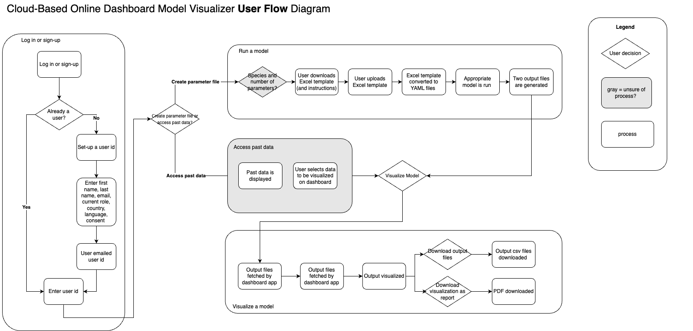

# Dynamic Dashboard Data Pipeline

This repository contains the code and documentation for a data pipeline that processes input files, converts them into YAML format, and makes them available for the Global Burden of Animal Diseases (GBADs) Dynamic Population Model (DPM). 

Once the model produces output files, these are stored and made accessible for a dashboard developer.

---

## Project Workflow

### **Overview**
1. **Input Handling**: Process Excel spreadsheets.
2. **Data Conversion**: Convert the data to YAML format.
3. **Model Integration**: Provide the YAML files to the model.
4. **Output Handling**: Store the model's output files and make them available for the dashboard developer.

### **User Flow Diagram**

There are two "versions" of how users will be expected to interact with the system. 

#### Online Version 



#### Desktop Version 

Diagram to be added. This version assumes no internet connection.

---

## Repository Structure

```
.
├── input_files/            # Directory for Excel input files
├── output_files/           # Directory for storing model output files
├── scripts/                # Python scripts for each pipeline step
│   ├── convert_to_yaml.py  # Converts Excel data to YAML
│   ├── upload_to_s3.py     # Uploads YAML files to AWS S3
│   ├── api_endpoint.py     # Serves files via an API
├── requirements.txt        # Python dependencies
├── diagrams/               # Diagrams for documentation
├── README.md               # Project documentation
```

Note that the repository structure includes a directory for input and output files; these are for tests. Actual input and output files will be stored in S3. 

### Updates to input_files/

Input files are updated according to changes to the overall flow the work. The readme has to be updated however I am adding the details here for now: 

* Sample DPM Files 
These files are outputs from the model. The following naming convention/mapping follows: 

"cattle_trial_CLM_current" is cattle
"CLM_S_Current" is small ruminants
"Cluster_1_Current" is equids
"Village_indigenous_current" is poultry

---
## API Usage

To run the API locally: 

```
uvicorn upload_to_s3:app --reload
```

There is a functional API for uploading and downloading files to and from S3 buckets. 

Example curl requests for upload: 

```
curl -X POST "http://127.0.0.1:8000/upload" \
  -F "bucket_name=<bucketname>" \
  -F "object_name=<nameofobject>" \          
  -F "file=@<pathtofiletobeuploaded>"
```

Example of curl requests for download:

```
curl -X GET "http://127.0.0.1:8000/download?bucket_name=my-bucket&object_name=path/to/file.txt" --output downloaded_file.txt
```

Example of API call for download:

```
http://127.0.0.1:8000/download?bucket_name=my-bucket&object_name=somefile.txt
```


---

## Future Enhancements
- Add error handling and logging for all scripts.
- Automate the pipeline using Apache Airflow (?)

---

## Contributors
- Kassy Raymond 

This GitHub template was generated using ChatGPT.

---

## License
This project is licensed under the [GNU General Public License](LICENSE).

